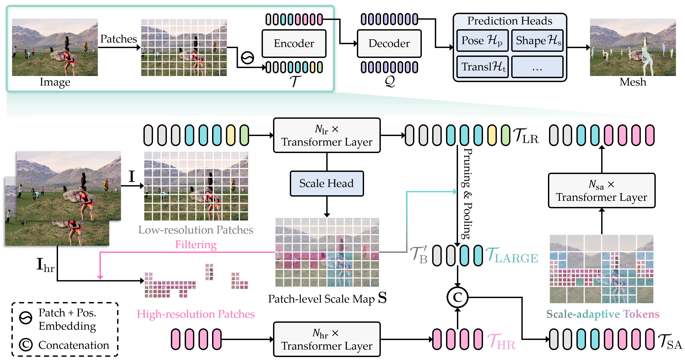

# sat-track

This project explores human mesh reconstruction and tracking in realistic (in-the-wild) settings.  
I integrated a state-of-the-art human mesh model (SAT-HMR) and a tracker (PHALP based on DeepSORT) to attempt a full human motion tracking + mesh reconstruction pipeline.

---

## 🎯 Objective

- Reconstruct 3D human meshes from images in the wild using **SAT-HMR**.  
- Track people over time using **PHALP / DeepSORT** to maintain identity across frames.  
- Evaluate feasibility: how well SAT-HMR generalizes to non-studio, real-world images, and whether combining mesh reconstruction + tracking is robust under those conditions.

---

## 🔧 Components

- **Mesh Reconstruction**: SAT-HMR (Scale-Adaptive Tokens HMR)  
- **Tracker**: PHALP built on **DeepSORT** for person re-identification & temporal consistency.  
- Image input: video frames or image sets “in the wild” (uncontrolled lighting, occlusions, varying backgrounds).  

---

## 📸 Overview of SAT-HMR

  

---

## 🙏 Acknowledgements

I would like to thank the developers of **SAT-HMR** (Chi Su, Xiaoxuan Ma, Jiajun Su, and Yizhou Wang) for their work on real-time multi-person 3D mesh estimation via scale-adaptive tokens ([GitHub](https://github.com/ChiSu001/SAT-HMR)), and the creators of **PHALP** (Jathushan Rajasegaran, Georgios Pavlakos, Angjoo Kanazawa, and Jitendra Malik) for their contributions to 3D human tracking in videos ([GitHub](https://github.com/brjathu/PHALP)). Their research and open-source implementations were instrumental in enabling my exploration of human mesh reconstruction and tracking in challenging, in-the-wild scenarios.
